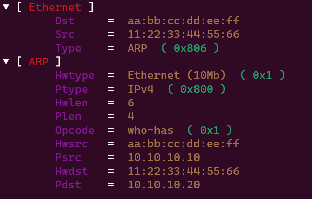

# How to build a packet ?

## Quick setup

To use the `vizion` library, you need to import it into your code as follows: 

```go
import (
    "github.com/AnataarXVI/vizion"
    "github.com/AnataarXVI/vizion/packet"
    "github.com/AnataarXVI/vizion/layers"
)
```

Next, run the command `go mod tidy` to install the library. Dependencies will be installed automatically.


## First step

First, you need to create a packet using the `Packet` structure.

```go
pkt := packet.Packet{}
```

For the moment, the packet is empty and contains no layers. 

## Second step

Now you need to create the layers you want to add to your packet. For this example, we'll create an ARP packet. To do this, we need to create an Ethernet layer and an ARP layer.

_For the Ethernet Layer :_

```go
dst, _ := net.HardwareAddr{0xaa, 0xbb, 0xcc, 0xdd, 0xee, 0xff}
src, _ := net.HardwareAddr{0x11, 0x22, 0x33, 0x44, 0x55, 0x66}

// Ethernet Layer
ethernetLayer := layers.EtherLayer()
ethernetLayer.Dst = dst
ethernetLayer.Src = src
ethernetLayer.Type = 0x0806
```

_For the ARP Layer :_

```go

hwsrc, _ := net.HardwareAddr{0xaa, 0xbb, 0xcc, 0xdd, 0xee, 0xff}
hwdst, _ := net.HardwareAddr{0x11, 0x22, 0x33, 0x44, 0x55, 0x66}
psrc := net.IP{10,10,10,10}
pdst := net.IP{10,10,10,20}

// ARP Layer
arpLayer := layers.ARPLayer()
arpLayer.Hwsrc = hwsrc
arpLayer.Hwdst = hwdst
arpLayer.Psrc = psrc
arpLayer.Pdst = pdst
```

You don't need to specify all fields, as the default values are set.


## Third step

All we have to do now is add our layers to our packet !


```go
pkt.AddLayers(&ethernetLayer, &arpLayer)
```

## Display a packet

You can display your packet to view its composition. 

```go
pkt.Show()
```



## Sending packet

The `Send()` function is used to send a packet, indicating the interface.

```go
vizion.Send(pkt, "lo")
```

```
Packet sent successfully.
```